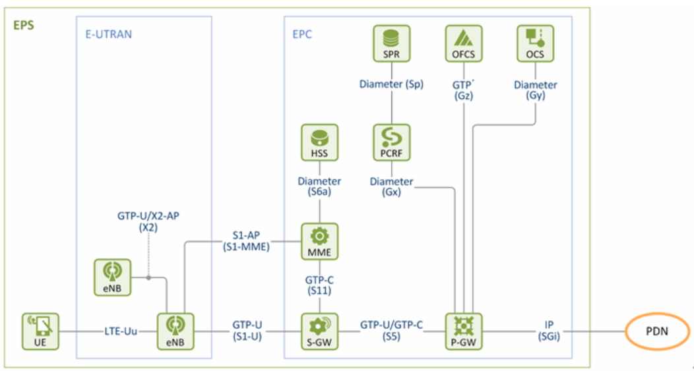
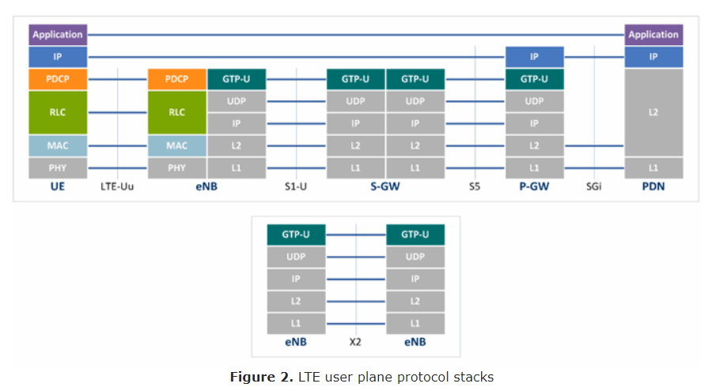
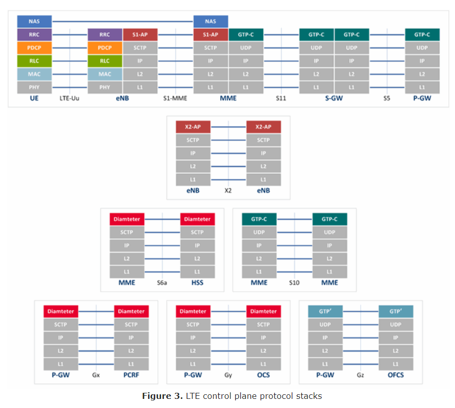

## **Intro**

[***LTE encyclopedia***](https://sites.google.com/site/lteencyclopedia/home)

This is a comprehensive site that introduces LTE technology.

## **Architecture**

[***LTE Architecture Basics***](https://www.netmanias.com/en/post/techdocs/5904/lte-network-architecture/lte-network-architecture-basic)

This document provides a brief overview of the LTE network architecture as the first technical document of “LTE” area. First, the LTE network reference model is defined and its basic Evolved Packet System (EPS) entities and the functions of each entity are described. Next, the interfaces between the EPS entities and the protocol stack across the interfaces are described. Finally, how user traffic is delivered across the LTE network is explained for Internet service.

[***Long-Term Evolution Network Architecture***](../Resources/Long-term_evolution_network_architecture.pdf)

This is a detail parper describing the LTE network architecture.

User PLane Protocol Stack:

Control Plane Protocol Stack:

## **LTE Network**

### **LTE Identifier**

LTE Identification:

[***UE and ME Identifiers***](https://www.netmanias.com/en/?m=view&id=techdocs&no=5905&tag=80&page=4)

As the first document for LTE Identification, this document (Part I, LTE Identification I) classifies LTE identifications into different groups, and describes two of these groups, i.e., User Equipment Identifiers (UE IDs) and Mobile Equipment identifiers (ME IDs). First, UE IDs such as IMSI, GUTI, S-TMSI, IP address and C-RNTI are explained and then UE IDs identified over the S1-MME and X2 interfaces are discussed. Then, ME IDs such as IMEI and IMEISV are explained. Finally features of UE and ME IDs are briefly summarized.

[***NE and Location Identifiers***](https://www.netmanias.com/en/?m=view&id=techdocs&no=5906&tag=80&page=4)

As the second document for LTE Identification, this document (Part II, LTE Identification II) describes Network Equipment identifiers (NE IDs) and Location Identifiers groups. Some NE such as MME, eNB and P-GW are included in NE IDs group, and NE IDs such as GUMMEI, MMEI, Global eNB ID, eNB ID, ECGI, ECI and P-GW ID are explained first. Then location IDs that identify location of UEs, such as TAC and TAI, are discussed. Finally, features of these IDs are briefly summarized.

[***EPS Session/Bearer Identifiers***](https://www.netmanias.com/en/?m=view&id=techdocs&no=5907)

As the third document for LTE Identification, this document (Part III, LTE Identification III) covers EPS Session/Bearer ID groups related to user traffic delivery. Session/Bearer IDs such as Packet Data Network (PDN) ID (Access Point Name (APN)), EPS bearer ID, E-RAB ID, Data Radio Bearer (DRB) ID, Tunnel Endpoint Identifier (TEID) and Linked EPS Bearer Identity (LBI) are described, followed by a summary of the characteristics of these IDs. Finally, all the LTE IDs covered in the three LTE Identification documents are listed.

### **LTE IP Address Allocation**

Types of IP Allocation:

Dynamic IP Address Allocation:

Static IP Address Allocation:

[***LTE IP Address Allocation Schemes I: Basic***](https://www.netmanias.com/en/?m=view&id=techdocs&no=7246&tag=80)

This document will describe how an LTE network allocates IP addresses to users accessing the network. IP addresses can be either dynamic or static depending on their allocators. Below we will discuss how the two types are different, and how they are allocated.

[***LTE IP Address Allocation Schemes II: A Case for Two Cities***](https://www.netmanias.com/en/?m=view&id=techdocs&no=7257)

This document presents a specific case of IP address allocation – allocation in geographically-separated locations within an LTE network. In case of dynamic allocation, no matter where a user accesses, a dynamically selected P-GW dynamically allocates an IP address to the user for PDN connection. In case of static allocation, however, there is always one specific P-GW and one IP address for a user - the designated P-GW allocates a static IP address for the user’s PDN connection. Here we will use an LTE network that serves two cities as an example to describe different ways and procedures of IP address allocation, and see how they are different from each other.

## **LTE EPS Mobility Management**

### EPS Mobility Management Scenarios

[***Eleven EMM Cases in an EMM Scenario***](https://www.netmanias.com/en/?m=view&id=techdocs&no=6002)

This document defines the EMM procedures, to be further discussed in subsequent documents, by using an EMM scenario and defining eleven EMM cases in the scenario. It briefly explains user experiences and device operations in each EMM case, and discusses how EMM, ECM and RRC states of a UE are changed before and after the EMM procedures.

### **LTE Handover**

[***Handover without TAU - Part 1. Overview of LTE Handover***](https://www.netmanias.com/en/?m=view&id=techdocs&no=6224)

This and two subsequent documents will discuss the handover procedure required when a UE, still being served through the LTE network it accessed, disconnects from its current serving cell, and connects to a new serving cell within the same Tracking Area (TA) as the UE travels (as defined as EMM Case No. 6 in our previous document). This document will provide the basic concept of LTE handover and the related procedures, and define the types and scopes of handovers to be covered in the subsequent documents that follow.

[***Handover without TAU - Part 2. X2 Handover***](https://www.netmanias.com/en/?m=view&id=techdocs&no=6257)

This document will describe the procedure for X2 handover performed in an intra-LTE environment, as defined as EMM Case 6 in our technical document, “Eleven EMM Cases in an EMM Scenario”. First, features related to handover on X2 protocol will be discussed, followed by detailed procedures of X2 handover. We will learn how a handover between eNBs is prepared and performed without EPC intervention, and how DL packets are forwarded through a direct tunnel between two eNBs during the handover interruption time for seamless service provision. We will also look into how EPC gets involved in switching the EPS bearer path after a handover. Finally, we will examine how the information elements in EPS entities are different before and after the X2 handover procedure.

[***Handover without TAU - Part 3. S1 Handover***](https://www.netmanias.com/en/?m=view&id=techdocs&no=6286)

This document will describe the procedure for S1 handovers performed in an intra-LTE environment, as defined as EMM Case 6 in our technical document, “Eleven EMM Cases in an EMM Scenario”. First, features related to handovers on S1 protocol will be discussed, followed by detailed procedures of S1 handover. We will learn how EPC (MME) intervenes in preparation of a handover between eNBs, and how DL packets are forwarded through an indirect tunnel that passes S-GW during the handover interruption time for seamless service provision. We will also look into how EPC gets involved in switching the EPS bearer path after a handover. Finally, we will examine how information elements in EPS entities are different before and after the S1 handover procedure.
